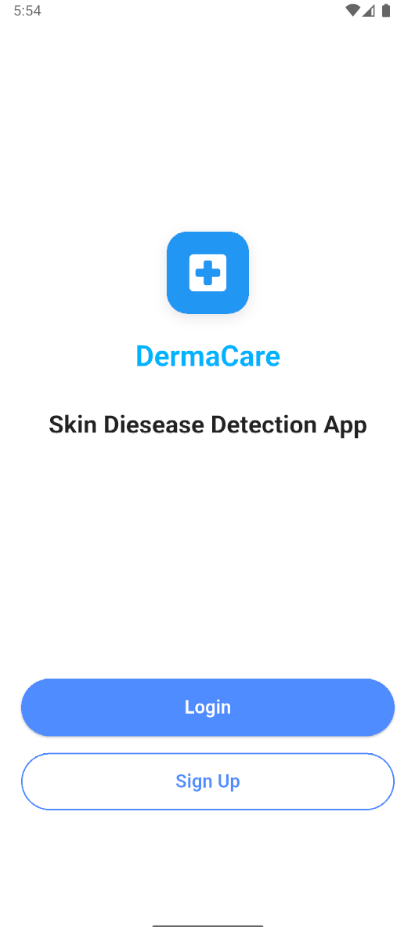
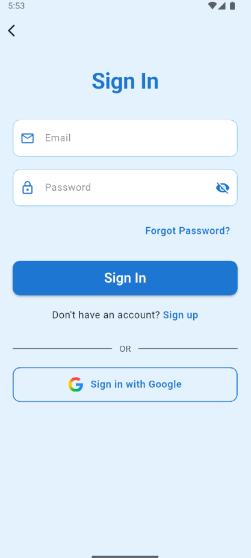
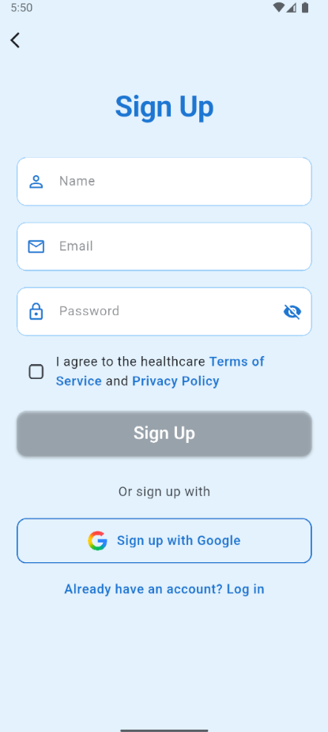

# DermaCare

DermaCare is a cross-platform mobile and backend application for skin condition detection and AI-powered skincare advice. The project consists of:

- `frontend/` — Flutter mobile app (iOS, Android, web, desktop) that provides user authentication, image upload for predictions, AI advisor, chat interface, and history.
- `backend/` — Flask backend that handles auth, image prediction (TensorFlow model), AI advisor proxying to Google Gemini, and stores user and history data in MongoDB.
- `Model/` — Machine learning artifacts (model, class names, predictor utilities).

This README documents architecture, setup, running locally, environment variables, API endpoints, data model, and security guidance.

## Table of Contents

- Project overview
- Architecture
- Prerequisites
- Backend setup (development)
- Flutter app setup
- Screen organization
- Environment variables
- API endpoints (summary)
- Database design
- Security recommendations
- Contributing
- Next steps

## Project overview

DermaCare lets users:
- Register/login locally or via Google OAuth
- Upload skin images to receive a predicted skin condition and confidence score
- Save, view, and delete prediction history (images + predictions)
- Use an AI Skin Advisor that augments responses with local weather information
- Save chat history and feedback

The backend exposes REST endpoints consumed by the Flutter app. The ML model lives in `Model/` and is invoked by the backend for predictions.

## Architecture

High-level components:
- Flutter mobile app → HTTP requests to Flask backend
- Flask backend → MongoDB (Atlas or local) for persistence
- Flask backend → TensorFlow model in `Model/` for prediction
- Flask backend → Google Gemini (via `google-generativeai`) for AI advisor
- Flask backend → OpenWeatherMap API for local weather

## Prerequisites

- Python 3.10+ (for backend)
- Node / Flutter SDK for mobile app development
- MongoDB Atlas account or a local MongoDB instance if preferred
- Google Cloud API key with access to Generative AI (Gemini) or the appropriate client credentials
- OpenWeatherMap API key

## Backend setup (development)

1. Open a terminal and navigate to the backend folder:

```powershell
cd d:\DermaCare\Derma-Care\backend
```

2. Create and activate a virtual environment (Windows PowerShell):

```powershell
python -m venv .venv
.\.venv\Scripts\Activate.ps1
```

3. Install dependencies:

```powershell
pip install -r requirements.txt
```

4. Create a `.env` file in the `backend/` folder (a template is already provided). Fill in the real values for the keys:

- MONGO_URI
- SECRET_KEY
- GOOGLE_CLIENT_ID
- GOOGLE_API_KEY (Gemini)
- OPENWEATHER_API_KEY

5. Run the backend locally:

```powershell
python app.py
```

The server will start on `http://0.0.0.0:5000` by default.

## Flutter app setup

Open the `frontend/` folder in your Flutter-capable IDE (VS Code or Android Studio). Configure any compile-time environment for the Gemini key if needed and run on your target platform.

Note: Avoid storing long-lived secret API keys directly in the Flutter app for production builds — prefer backend proxies or token-exchange flows.

## Screen organization

The Flutter app contains 16 screens organized into the following categories.

### Screenshots

Sample screenshots from the app:

| Splash Screen | Login Screen | Signup Screen |
|---------------|--------------|---------------|
|  |  |  |

### Authentication Screens

These screens handle user authentication and onboarding:

| Screen File | Description | Route/Navigation | Screenshot |
|-------------|-------------|------------------|------------|
| `auth/splash_screen.dart` | Initial splash screen shown on app launch | Entry point | [View](screensorts/splash_screen.png) |
| `auth/login_screen.dart` | User login with email/password or Google OAuth | `/login` | [View](screensorts/login_screen.png) |
| `auth/signup_screen.dart` | New user registration with email/password | `/signup` | [View](screensorts/signup_screen.png) |
| `auth/forgot_password_screen.dart` | Password reset flow for existing users | `/forgot-password` | - |

### Home/Main Screens

Core navigation and dashboard screens:

| Screen File | Description | Route/Navigation |
|-------------|-------------|------------------|
| `home/main_screen.dart` | Main container with bottom navigation (Home, Analysis, Tips, History, Profile) | `/main` |
| `home/home_screen.dart` | Dashboard/home screen showing quick actions and recent activity | `/home` |

### Skin Analysis Screens

Screens for uploading and analyzing skin images:

| Screen File | Description | Route/Navigation |
|-------------|-------------|------------------|
| `home/skin_prediction_screen.dart` | Upload skin image, get AI prediction with confidence score, display results | `/skin-prediction` |

### AI Advisor Screens

AI-powered skincare tips and advice:

| Screen File | Description | Route/Navigation |
|-------------|-------------|------------------|
| `home/skin_tips.dart` | AI Skin Advisor - ask questions and get personalized skincare advice with weather context | `/skin-tips` |
| `home/skin_tips_history_screen.dart` | View past AI advisor queries and responses | `/skin-tips-history` |
| `home/skin_tips_history_detail_screen.dart` | Detailed view of a single AI advisor conversation | `/skin-tips-detail` |

### Chat/Disease Info Screens

Interactive chat for disease information:

| Screen File | Description | Route/Navigation |
|-------------|-------------|------------------|
| `home/disease_info_screen.dart` | Chat interface to ask questions about detected skin conditions | `/disease-info` |
| `home/disease_info_history_screen.dart` | View past disease info chat conversations | `/disease-info-history` |
| `home/disease_info_detail_screen.dart` | Detailed view of a single disease info chat session | `/disease-info-detail` |

### History Screens

View and manage past predictions and analyses:

| Screen File | Description | Route/Navigation |
|-------------|-------------|------------------|
| `home/history_screen.dart` | View all prediction history (images + results), with options to delete or clear | `/history` |

### User Profile & Settings

User account management and app configuration:

| Screen File | Description | Route/Navigation |
|-------------|-------------|------------------|
| `home/profile_screen.dart` | View user profile, account details, logout option | `/profile` |
| `home/settings_screen.dart` | App settings and preferences (notifications, theme, etc.) | `/settings` |

### Navigation Flow

```
Splash Screen
    ↓
Login Screen ←→ Signup Screen
    ↓                ↓
    └────────────────┘
            ↓
    Main Screen (Bottom Nav)
    ├── Home Screen (Dashboard)
    ├── Skin Prediction Screen
    │       └→ Disease Info Screen (Chat)
    │              └→ Disease Info History Screen
    │                     └→ Disease Info Detail Screen
    ├── Skin Tips (AI Advisor)
    │       └→ Skin Tips History Screen
    │              └→ Skin Tips History Detail Screen
    ├── History Screen (All Predictions)
    └── Profile Screen
            └→ Settings Screen
            └→ Forgot Password Screen (if needed)
```

### Screen Summary

- **Total Screens**: 16
- **Authentication**: 4 screens
- **Main Navigation**: 2 screens
- **Analysis**: 1 screen
- **AI Features**: 3 screens (tips + history)
- **Chat/Info**: 3 screens (disease info + history)
- **History**: 1 screen
- **Profile**: 2 screens

**Note**: Most screens require authentication (JWT token) except splash, login, signup, and forgot password. Navigation is primarily handled through the bottom navigation bar in `main_screen.dart`.

## Environment variables

A `backend/.env` template exists. For local development, `app.py` loads `backend/.env` using `python-dotenv`.

Minimum required variables:

- MONGO_URI — e.g. `mongodb+srv://<user>:<pass>@cluster0.mongodb.net/Cluster0?retryWrites=true&w=majority`
- SECRET_KEY — Random string for JWT signing
- GOOGLE_CLIENT_ID — OAuth client ID for Google Sign-In
- GOOGLE_API_KEY — API key for Google Gemini
- OPENWEATHER_API_KEY — API key for OpenWeatherMap

## API endpoints (summary)

The backend exposes these main endpoints (all `backend/app.py` routes):

- POST `/register` — Register new user (email + password)
- POST `/login` — Login (returns JWT)
- POST `/auth/google` — Google OAuth sign-in (returns JWT)
- POST `/predict` — Upload `image` file; returns predicted class and confidence
- POST `/history` — Save prediction history item (image + metadata) (authenticated)
- GET `/history` — List prediction history (authenticated)
- DELETE `/history/<id>` — Delete a history item (authenticated)
- POST `/api/ai-advisor` — Query AI advisor (requires `GOOGLE_API_KEY` and OpenWeather key on backend)
- POST/GET `/advisor-history` — Save and fetch AI advisor history (authenticated)
- POST/GET `/chat/history` — Save and fetch chat history (authenticated)
- POST `/feedback` — Submit feedback (authenticated)

Authentication: Most endpoints require a Bearer JWT in the `Authorization` header.

## Database design

See `database_design.md` for full details; key collections include `users`, `predictions`, `chat_history`, `advisor_history`, `analyses`, and `feedback`.

## Security recommendations

- Do not commit `.env` to source control. Add `/backend/.env` to `.gitignore`.
- Remove any hard-coded API keys from source files (I removed fallbacks from `backend/app.py`).
- Use a secrets manager for production (e.g., AWS Secrets Manager, Azure Key Vault, GCP Secret Manager).
- For Flutter apps, avoid shipping secret API keys in the binary. Use the backend as a proxy for requests to Gemini/OpenWeather, or use ephemeral tokens.

## Contributing

- Run backend unit tests (if any) and linters before submitting PRs.
- Keep secrets out of commits.

## Next steps / Improvements

- Add automated tests for endpoints and model predictions.
- Move ML model to a separate microservice or container for scaling.
- Use a proper CI pipeline, and integrate environment-specific deployment configs.
- Implement rate-limiting and monitoring for the AI endpoints.

---

If you'd like, I can also:
- Add a `.gitignore` entry to exclude `backend/.env`.
- Remove the fallback GEMINI key from the Flutter `config.dart` and wire it to a safer retrieval approach.
- Create a small script to populate a sample `.env` from environment variables.

Tell me which of the above you'd like next and I'll implement it.